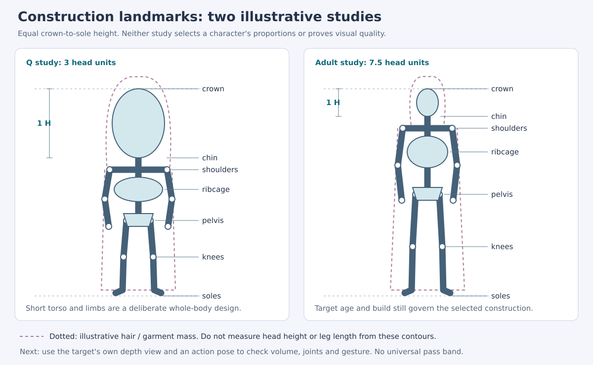

# Design and Repair Examples

Use these worked cases to turn a brief into a drawing or choose a repair. The
[proportion reference](humanoid-proportion-design.md) owns route selection and
measurement. These examples introduce no new acceptance thresholds.

## Read a construction, not just a head count

The diagram is an original schematic: a 3-head Q study and a 7.5-head adult
study at equal crown-to-sole height. These are examples, not approved masters,
ideal proportions, accurate anatomy lessons, or runtime-size previews. Colored
forms indicate a simple clothed blockout; dotted contours illustrate hair and a
garment. The head unit excludes both. Pelvis and knees locate the underlying
stance; a skirt hem does not measure legs. The full-size SVG can be opened or
rendered by the available viewer; use the descriptions here if SVG is unsupported.

For a Q brief, choose the whole design: head/face simplification, neck connection,
torso-to-leg balance, usable hands/feet and costume masses. For a modeled-style
brief, retain the target's age/build and coherent shoulder, ribcage, pelvis and
limb relationships. Carry those relationships into a depth view and an action
pose; do not infer joint construction from a beautiful front silhouette alone.

### Convert an observation into a generation instruction

Example input: the brief selects a compact adult Q swordswoman. Its selected
construction has a short torso, visibly separate feet and hands large enough to
read a grip. The face/costume reference has a wide sleeve, and a weapon reference
supplies shape only. These are hypothetical inputs, not a new character request.

Useful instruction:

> Use the selected construction for body relationships and the identity source
> for face, hair and costume. Keep the established neck connection and torso/leg
> balance; make the sword grip visible outside the sleeve. Retain the weapon's
> outline from its shape reference, rendering it in the same simplified material
> language as the character. Preserve the selected camera and full-body framing.

For an adult modeled-style variant, replace the construction authority with its
own source-derived body design; do not reuse the Q construction or merely shrink
its head. Add the actual reference IDs, permitted changes and generation fields
from [Generation Job Graph](generation-job-graph.md). This paragraph is the design
part of a request, not a complete tool prompt or a replacement action contract.

## Case 1: a preferred silhouette is not a measured standard

Observed in the local 2026-09-26 Zi Ling comparison: four frontal candidates
became progressively less head-dominant. The user preferred D; the comparison
review also recorded face/veil/detail drift, a long skirt obscuring leg structure,
and weaker facial readability in the smaller C/D previews. It was exploratory
evidence, without a measured head-count, identity or motion pass. The original
images and hash-bound reviews remain with that local run, not in this skill.

| Step | Apply to the current target |
|---|---|
| Separate the claims | Preserve the selected proportional direction. Keep head-count, hidden knee/pelvis locations, likeness and motion unverified until supported. |
| Resolve structure | Use clear target views or a clothed construction to locate pelvis, knees and soles; label inferred landmarks. Do not stretch the skirt or bitmap to achieve a number. |
| Resolve small-size readability | Compare the same exported base frame at the intended supported sizes; inspect framing and detail hierarchy before changing the body. |
| Recheck | Compare equal-height structure and actual-size presentation; record remaining face, costume or rendering drift instead of calling the experiment perfectly controlled. |

This case did not establish a successful final repair or reject the Q route for
other characters. The repair sequence is guidance, not a fabricated before/after
success story. In a future completed run, attach the actual old/new hashes and
verdicts before promoting it to a successful worked repair.

## Case 2: the same complaint can require different repairs

“The head looks too big” names a symptom. Use the source image, silhouette,
construction and actual-size view to distinguish the cause:

| Evidence | Hypothesis and first repair | Preserve and recheck |
|---|---|---|
| Anatomical head/shoulder relationship disagrees with selected construction even with hair separated | Rebuild the affected head–neck–shoulder structure using that construction. | Face identity, neck connection and nearby poses. |
| Skull agrees, but hair/ornaments dominate the outline | Check whether that volume belongs to the character; if accidental, repair only hair mass within allowed stylization. | Identity-defining hairstyle and ornaments; intentional large hair is not automatically a defect. |
| Head agrees, shoulders or torso were pinched by generation | Restore shoulders/torso from target evidence rather than reducing the head again. | Ribcage/pelvis connection, sleeve clearance and hand positions. |
| Whole figure is tiny or facial detail disappears only after export | Inspect transparent margins, export detail and supported display scale; simplify tertiary detail if appropriate. | Selected anatomy, aspect ratio, movement space and identity cues. |

These are diagnostic examples, not reports of measured outcomes. If evidence
does not distinguish causes, use a small controlled comparison and record that
uncertainty rather than inventing a precise numerical correction.

## Case 3: a useful reference can still be the wrong production input

The local 2026-08-30 Li Yingning Q rebuild separated official weapon evidence,
old character references and a shape-only weapon reference from rejected action
batches. Its source record explicitly limited old character art to costume and
proportion reference, and the detailed weapon image to outline reconstruction.
This records an input-selection correction, not proof that a new pet passed.

Transferable repair: record each input's allowed role, then redraw the required
pose/materials in the selected style. Do not paste old action pixels or realistic
weapon texture into a Q body merely because the source looks detailed. Review
hand contact, prop ownership and occlusion at the key pose and neighboring frames.

For alpha defects or sliding motion, use the causal repair rules in
[Repair and Convergence](repair-and-convergence.md) and
[Actions and Motion](actions-and-motion.md); do not generalize these proportion
cases into a cure for every failure.

## Retain useful examples without inventing evidence

Keep a run-local example record: symptom; source/candidate paths and hashes;
observations versus hypotheses; repair attempted; features preserved; old/new
actual-size views; relevant action playback; review verdicts; remaining limits.
Link existing run artifacts rather than copying private source material into
the skill. A case with only an attempted correction stays an attempted case.
Add a portable example only when it teaches a distinct decision, and share images
only within the user's authorized scope. Do not turn an example's geometry,
head count, action count or user preference into another character's default.
